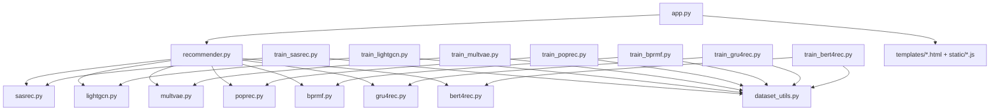
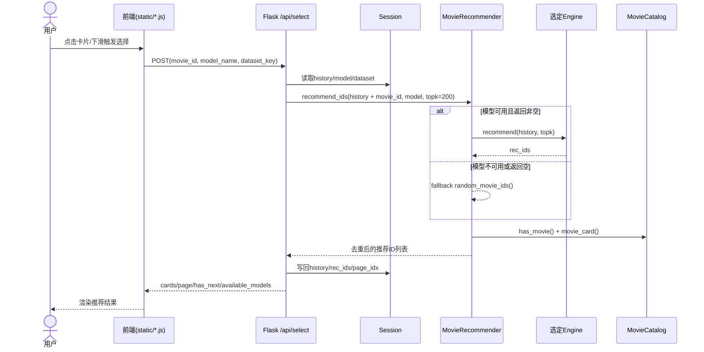
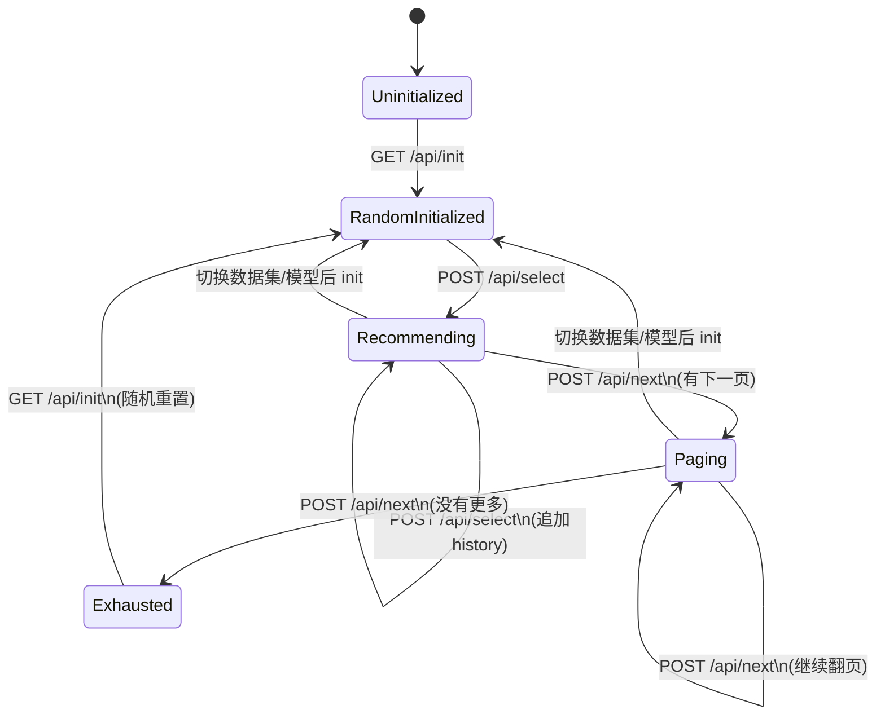
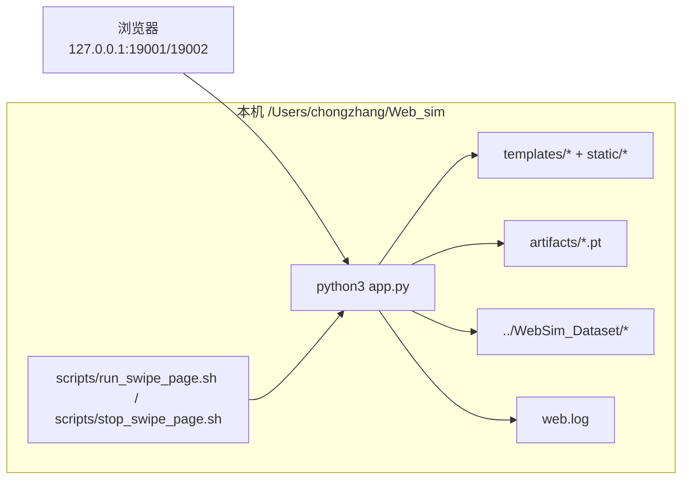

# Web_sim 软件工程图谱

下面这套图是按 `/Users/chongzhang/Web_sim` 当前代码结构绘制的，覆盖了你这个项目最常用的几类软件工程图。

## 1) 系统架构图（Component / Container）

```mermaid
flowchart LR
  User[用户 / Browser]

  subgraph Frontend[前端层]
    Grid[templates/index.html + static/app.js]
    Swipe[templates/swipe.html + static/swipe.js]
  end

  subgraph Backend[后端层 Flask app.py]
    API[/api/init /api/select /api/next /health /poster]
    Session[Flask Session]
    RecMgr[get_recommender()]
  end

  subgraph RecLayer[推荐层 recommender.py]
    MR[MovieRecommender]
    Catalog[MovieCatalog]
    Engines[SASRec/LightGCN/MultVAE/PopRec/BPRMF/GRU4Rec/BERT4Rec Engines]
  end

  subgraph DataAssets[数据与模型]
    Datasets[MovieLens-1M / Amazon MI]
    Artifacts[artifacts/*.pt]
    Posters[posters/ images/]
  end

  User --> Grid
  User --> Swipe
  Grid --> API
  Swipe --> API
  API --> Session
  API --> RecMgr
  RecMgr --> MR
  MR --> Engines
  MR --> Catalog
  Engines --> Artifacts
  Catalog --> Datasets
  Catalog --> Posters
  API --> Catalog
```

## 2) 模块依赖图（Module Dependency）



## 3) 核心接口时序图（Sequence: `/api/select`）



## 4) 训练流程活动图（Activity）

```mermaid
flowchart TD
  start([开始]) --> load[加载序列: load_user_sequences]
  load --> remap[重映射item + 划分train/valid/test]
  remap --> build[构建训练数据集或采样器]
  build --> loop{epoch <= epochs?}

  loop -->|是| train[训练1个epoch]
  train --> valid[验证集评估 HR@10/20, NDCG@10/20]
  valid --> best{HR@10提升?}
  best -->|是| keep[保存best_state_dict]
  best -->|否| cont[继续下一轮]
  keep --> cont
  cont --> loop

  loop -->|否| loadbest[加载最佳checkpoint]
  loadbest --> test[测试集评估]
  test --> save[保存artifact到artifacts/*.pt]
  save --> end([结束])
```

## 5) 会话状态图（State Machine）



## 6) 部署运行图（Deployment / Runtime）



## 可继续扩展

如果你后面要写论文或技术报告，我可以在这套图基础上再补：
- UML 类图（精确到 `MovieRecommender` 与各 Engine 的属性/方法）
- 数据流图（DFD）
- C4 Model 的 Level 1/2/3 全套版本
